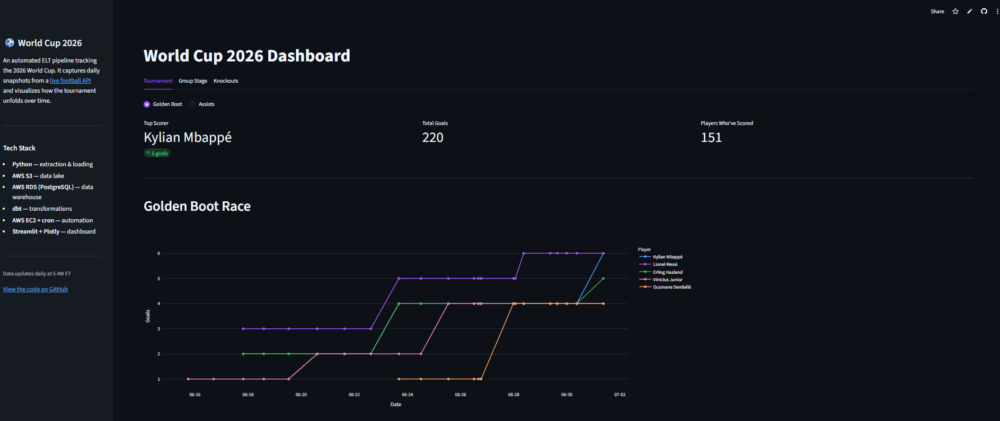
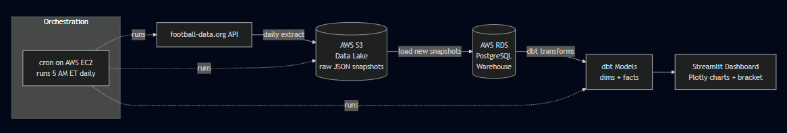

# World Cup 2026 Data Pipeline & Dashboard

An **ELT data pipeline** that captures daily snapshots of the 2026 FIFA World Cup from a [live football API](https://www.football-data.org/), lands them in a cloud data lake, models them in a Postgres warehouse with **dbt**, and serves an interactive **Streamlit** dashboard, fully automated on AWS.

Because the source API only exposes the tournament's *current* state, the historical trend views exist only by snapshotting and warehousing it daily. That is the core purpose of the pipeline.

**🔗 Live dashboard:** https://worldcup-2026-dashboard.streamlit.app/

---

## Architecture

| Layer | Technology | Role |
|-------|-----------|------|
| **Extraction** | Python (`requests`) | Pulls 5 API endpoints|
| **Data lake** | AWS S3 | Stores raw JSON snapshots (immutable source of truth) |
| **Warehouse** | AWS RDS (PostgreSQL) | Staging tables hold the raw JSON; modeled tables hold clean data |
| **Transformation** | dbt | Shapes raw JSON into clean, structured tables |
| **Orchestration** | cron on AWS EC2 | Runs the full extract, load, and transform pipeline daily |
| **Dashboard** | Streamlit + Plotly | Interactive, hosted on Streamlit Community Cloud |

## How the pipeline works

The whole pipeline runs as a single scheduled job (`run_pipeline.sh`) on an EC2 instance every morning at 5 AM ET:

**1. Extract.** A Python script hits five endpoints of the football API and saves each response as a timestamped JSON file in the S3 data lake.

**2. Load.** A loader checks S3 for snapshots not yet in the warehouse and loads only the new ones into Postgres staging tables. Each staging table stores the raw JSON exactly as received, keeping an untouched copy of the source.

**3. Transform.** dbt reads the raw JSON out of staging and builds clean, structured tables. This is where the messy nested JSON becomes analytics-ready, and where tournament-specific logic (deriving match winners, computing true scores) lives.

**4. Serve.** The Streamlit dashboard queries the clean tables directly. It is hosted on Streamlit Community Cloud, which auto-deploys from this repo, so a push to `main` redeploys the app while the EC2 pipeline keeps the warehouse fresh.

---

## Data modeling

The warehouse follows a **star schema** built entirely in dbt.

**Dimensions**

- `dim_teams`: one row per team (name, abbreviation, crest, coach, group)
- `dim_players`: ~1,250 players from team rosters (name, position, date of birth)

**Facts**

- `fct_standings`: group standings per snapshot
- `fct_scorers`: goal, assist, and penalty tallies per player per snapshot
- `fct_matches`: every finished match with its true on-field score
- `fct_knockout`: knockout matches with derived winners and shootout handling
- `fct_match_referees`: which referee officiated which match

---

## Design decisions

- **cron over Airflow.** The pipeline is three linear steps run once daily, so cron is the right-sized tool. Airflow would be overhead with no payoff at this scale.
- **ELT over ETL.** Raw JSON lands untouched in S3 before any shaping happens in dbt. This keeps an immutable record of exactly what the source returned, which proved invaluable when the API revised its own historical data.

---

## Limitations

The pipeline is built on a free API tier, which shapes what is possible:

- **The source occasionally revises its own historical data.** The pipeline records the source faithfully rather than reconciling it, treating these changes as part of the data's lineage.
- **Some stats are incomplete.** The API exposes certain secondary stats only for a subset of players, so a few metrics cannot be fully ranked across the whole tournament.
- **No lineup-level detail**, which limits how granular the player stats can get.
